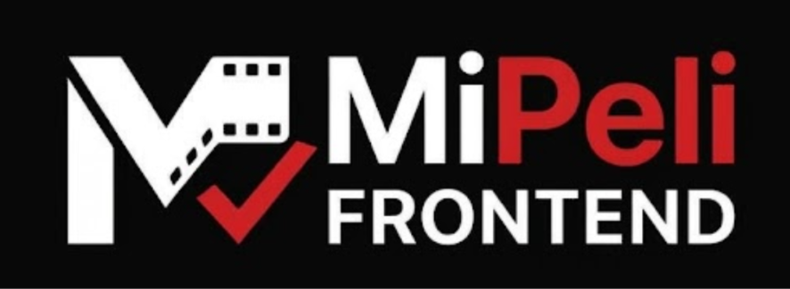

<div align="center">



### A movie recommender that asks you questions instead of making you search.

Answer a one-minute survey and find out what to watch tonight and where: on streaming in Costa Rica or, if it's showing, in a cinema.

<br>

[](https://react.dev/)
[](https://www.typescriptlang.org/)
[](https://esbuild.github.io/)
[](https://firebase.google.com/)

<sub>Mood survey · Poster duels · Where to watch · Saved surveys</sub>

</div>

## The experience

MiPeli turns the nightly question, "what do we watch tonight?", into a short survey: where you watch, your mood (a feeling, never a "genre"), the context, four poster duels and your favorites. In return you get a gallery of framed posters where each movie explains why it showed up and where to watch it.

This repo is the **frontend** only. The backend will live in a separate repo.

## Main features

- ~1 minute survey: platforms, mood, context (time, who with, what to avoid), poster duels and up to 3 favorites with search. It opens by asking where you want to watch.
- Results in a gallery of framed posters, with director, cast, IMDb rating, platforms and buttons to fine-tune (more like this, already seen, not interested).
- "In theaters" as one more platform, next to the streaming ones.
- Sign in with Google, email and password, or as a guest.
- **My profile**: each survey of an account is saved automatically and can be renamed, reopened or deleted. Guests save nothing.
- Spanish and English, dark and accessible interface, animations that respect `prefers-reduced-motion`.

## App flow

1. **Landing** (`Welcome`): informational page. Its only entry point is at the bottom: "Let's go!" or, with an open session, "Continue as …".
2. **Login**: Google, email and password (sign up, reset) or guest, over the poster wall.
3. **Survey** (`Quest`): platforms (with "Recommend me anywhere"), mood, context, 4 duels and favorites. Each signal is detailed in [docs/recomendacion.md](docs/recomendacion.md).
4. **Loading** (`Loading`, simulated) and **Results** (`Results`). The number of movies is changed right there; platforms are only chosen at the start of the survey. Cinemas have no link or showtimes: TMDB doesn't provide them.
5. **My profile** (`Profile`, `#perfil`, signed-in only): saved surveys and sign out. Repeating the survey, starting over, deleting a saved one and opening one while another is half-done all ask for confirmation.

FAQ and Contact are separate screens (`#faq`, `#contacto`). All text lives in `src/i18n.ts` in Spanish and English; any new text must carry both versions.

## Tech stack

| Area | Technology |
| --- | --- |
| Framework | React 19, TypeScript |
| Bundling | esbuild (`build.mjs`), no Vite |
| Animation | GSAP + ScrollTrigger |
| Icons and type | Phosphor, Geist, Bodoni Moda (`@fontsource-variable`) |
| Authentication | Firebase Authentication (Google, email and password) |
| Data (backend, pending) | TMDB, OMDb, JustWatch, optional TasteDive |

## Getting started

### Requirements

- Node.js 20.12 or newer (`build.mjs` uses `process.loadEnvFile`)
- npm

### Run locally

```bash
git clone https://github.com/Andreysillo/MiPeli-Frontend.git
cd MiPeli-Frontend
npm install
npm run dev
```

Open [http://localhost:8000](http://localhost:8000) (or the next free port). It reloads on save and Ctrl+C stops it.

## Configuration

Without a `.env` the app still works and sign-in just shows a notice. To enable it, copy `.env.example` to `.env`:

```dotenv
# firebaseConfig values; build.mjs injects them with `define`
FIREBASE_API_KEY=...
FIREBASE_AUTH_DOMAIN=...
FIREBASE_PROJECT_ID=...
FIREBASE_APP_ID=...
```

1. In [console.firebase.google.com](https://console.firebase.google.com) create a project (Spark plan, free and no card).
2. **Authentication → Get started → Sign-in method**: enable **Google** and **Email/Password**.
3. **Project settings → Your apps → Web (`</>`)**: register the app and copy the `firebaseConfig` values.
4. Paste them into `.env` and restart `npm run dev` from `localhost`. For `127.0.0.1` or another domain, add it under **Authentication → Settings → Authorized domains**.

Passwords are stored (encrypted) by Firebase; MiPeli never sees them. Once the backend exists, the frontend will send it `user.getIdToken()` and it will verify it with Firebase Admin.

## Quality

```bash
npm run build      # generates dist/
npm run typecheck  # tsc --noEmit
npm run check      # rules of the demo recommender (src/recommend.check.ts)
npm run smoke      # after the build: serves dist/ with the vercel.json headers and walks landing → login → survey
```

`smoke` uses Chrome (another browser: `SMOKE_CHANNEL=msedge npm run smoke`). `npm audit` (critical only), `typecheck`, `check`, the build and `smoke` run in GitHub Actions; Dependabot proposes updates every month.

## Security

- **XSS:** no `innerHTML`, `dangerouslySetInnerHTML` or `eval`; React escapes everything the user types. External links carry `rel="noopener noreferrer"`.
- **Headers** (`vercel.json`): restrictive CSP (`default-src 'self'`; only Google/Firebase are opened for sign-in), `nosniff`, `frame-ancestors 'none'`, `Referrer-Policy` and `Permissions-Policy`. `Cross-Origin-Opener-Policy: same-origin` is not used because it breaks the Google popup. All styling lives in CSS (no injected `<style>`); inline `style` is allowed only as an attribute. **When the backend is connected, add the TMDB image host (`img-src`) and the API URL (`connect-src`) to the CSP**; `npm run smoke` warns if something gets blocked.
- **No cookies or CSRF:** the session is Firebase's (IndexedDB) and the backend will receive `Authorization: Bearer`. Passwords are stored by Firebase; repeated attempts are rate-limited by Firebase (`auth/too-many-requests`).
- **Backend (pending):** validate everything with Pydantic, take the `uid` only from the verified token, rate-limit by IP on `/recommend` and by user on `/surveys`, and CORS only to the Vercel domain. Mongo doesn't use SQL, but avoid filters built from raw data (NoSQL injection).
- **Dependencies:** `npm audit` flags high vulnerabilities in `@grpc/grpc-js` via Firestore (a dependency of `firebase` that the app doesn't import); review when updating Firebase.

## Status and to-do

- Done: the whole interface, real sign-in (Firebase), saved surveys and a demo catalog with a local recommender (`src/data.tsx`, `src/recommend.ts`).
- Missing: the **backend** (another repo): catalog, posters and cast from TMDB (TasteDive as an optional booster), platforms (credited to JustWatch) and IMDb ratings from OMDb. The contract, the algorithm and the test to decide on TasteDive are in [docs/recomendacion.md](docs/recomendacion.md). When connecting it, replace `recommend()` and `data.tsx`, send `user.getIdToken()` and update the privacy text in FAQ and Contact if data gets stored.
- Saved surveys live only in each account's browser (`src/history.ts`) and aren't synced across devices. Cinema, demo data today, will come from TMDB (the "Cine" section of `docs/recomendacion.md`).
- Privacy: the app uses no cookies (verified in the browser) and has no analytics. If analytics, ads or third-party content are added, a consent notice is needed before loading them, along with updating `privacyPoints` and the FAQ.
- In Google Cloud, restrict the Firebase API key to the app's domains before publishing.

## Structure

```
index.html            entry HTML (esbuild copies it to dist/)
build.mjs             build and dev server (esbuild; reads .env and injects Firebase with define)
vercel.json           Vercel build and security headers (CSP, nosniff, frame-ancestors…)
scripts/smoke.mjs     smoke test with the vercel.json headers (npm run smoke)
src/
  main.tsx            mounts <App />
  App.tsx             shell: header (nav, My profile, language), current screen, confirmation notices, toast
  auth.ts             Firebase Authentication: Google, email/password, reset, sign out, session listener
  words.ts            splitWords: words with stable keys (animated headlines)
  useGoogleSignIn.ts  Google button hook (loading state and notices), shared by Welcome and Login
  assets/             MiPeli logos (frontend and backend) and, in platforms/, those of the streaming platforms and cinema (PNG/JPG, esbuild copies them with a hash to dist/)
  store.ts            global state (screen, answers, session, saved surveys, localStorage persistence, #hash routes)
  history.ts          each account's saved surveys (in the browser today, one list per uid); the seam the backend will replace
  i18n.ts             es/en text
  data.tsx            TMDB-shaped demo catalog with canvas poster art; the backend will replace it
  survey.ts           survey config: steps, moods, company, what to avoid, duels, suggestions and favorites search
  recommend.ts        local recommender (demo): score, reasons and flags per movie; the seam the backend will replace
  recommend.check.ts  quick check of those rules (npm run check)
  steps/              one file per survey step, plus StepHeader
  screens/            one screen per file (Welcome, Login, Quest, Loading, Results, Profile, Faq, Contact)
  components/         Button, Reveal, PosterGallery, Movie, PosterWall, ConfirmDialog, SiteNav, Ambient, Rise, CountUp, GoogleG,
                      Credits (TMDB, JustWatch and OMDb attributions), DriftWall (React Bits wall, .jsx)
  styles/global.css   design tokens (color, radii, type) and mp-* classes
```

## Project conventions

- I make the commits by hand, in English and with Conventional Commits (`feat(ui): …`, `fix(auth): …`).
- Code written to pass SonarQube: handlers only on native `<button>`s, no JSX inside arrays, no indexes as `key`, no nested ternaries and `Readonly<{…}>` props.
- A single visual system for all screens (same header, typography, cards and buttons).
- The TMDB, JustWatch and OMDb attributions are mandatory and are not removed.
- `graphify-out/` (code graph for navigating the repo) is local and not pushed; refresh it with `graphify update .`.

## Palette (60-30-10 rule)

- **60%** movie-theater background `#0F0F14`.
- **30%** text `#F4F4F4`, grays, borders and cards `#1F1F2E`. Selection, focus and progress are white.
- **10%** red `#E50914`, only on the primary action button (`.btn-primary`); with white text it reaches 4.8:1 (WCAG AA).

The Google button follows the dark theme of the [Sign in with Google brand guidelines](https://developers.google.com/identity/branding-guidelines). Posters keep their colors: they are content, not interface.

## Data credits

TMDB requires showing its logo and the notice "This product uses the TMDB API but is not endorsed or certified by TMDB", plus crediting JustWatch for platform data; OMDb asks to cite its CC BY-NC 4.0 license. All of that is in the Credits section of Contact (`src/components/Credits.tsx`) and **must not be removed** when connecting the backend.

## Author

Andrey Jiménez, advanced Computer Engineering student at the Costa Rica Institute of Technology (TEC). [GitHub](https://github.com/Andreysillo)
